## Salma EZACCANI
# Développement d'un micro-service
Ce projet est un micro-service de gestion de comptes bancaires développé avec Spring Boot. Il inclut des fonctionnalités telles que la gestion des comptes via une API REST, l'utilisation de Spring Data JPA pour la persistance des données, ainsi qu'une documentation Swagger et l'intégration d'un service GraphQL.

## Les tâches réalisées
- Créer le Web service Restfull qui permet de gérer des comptes
- Tester le web micro-service en utilisant un client REST comme Postman
- Générer et tester le documentation Swagger de des API Rest du Web service
- Exposer une API Restful en utilisant Spring Data Rest en exploitant des projections
- Créer les DTOs et Mappers
- Créer la couche Service (métier) et du micro service
- Créer un Web service GraphQL pour ce Micro-service

#### a. Project Structure
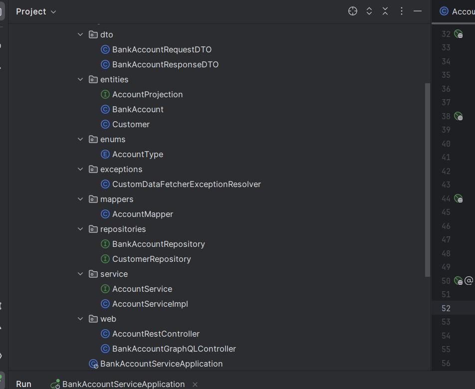

#### b. Bank Account
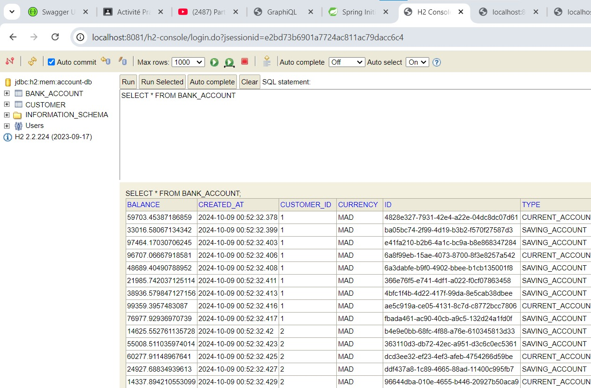

#### c. Customer
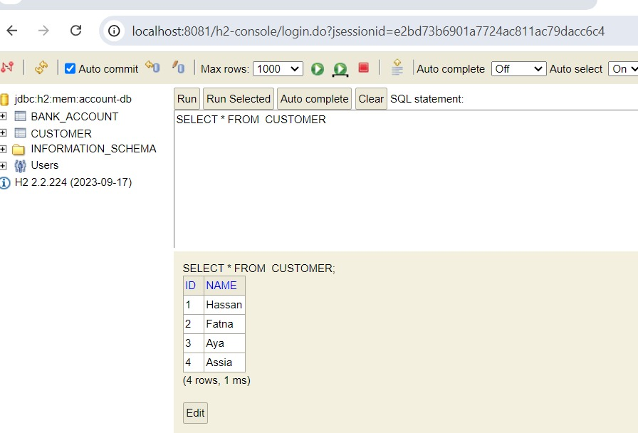

## Demo

#### RESTFUL
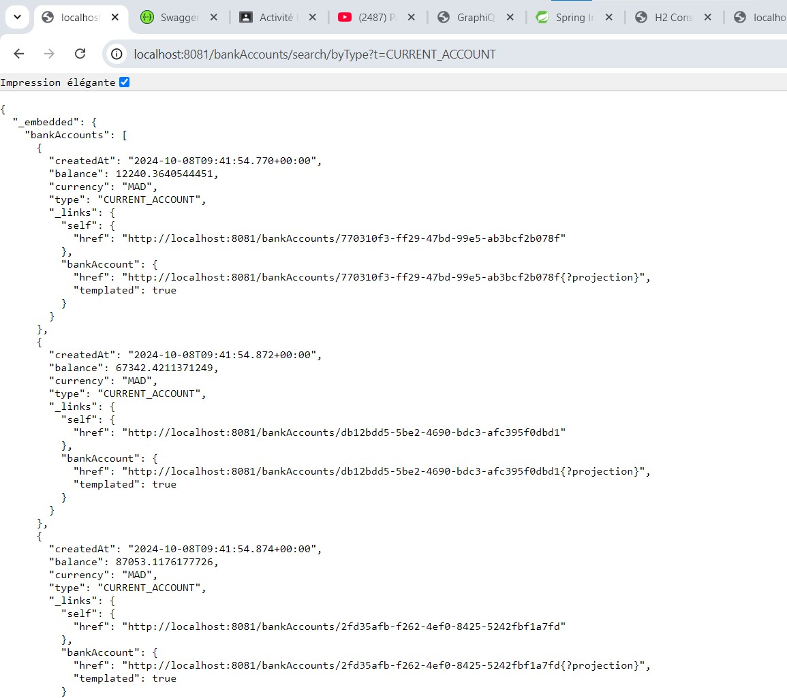

#### POSTMAN
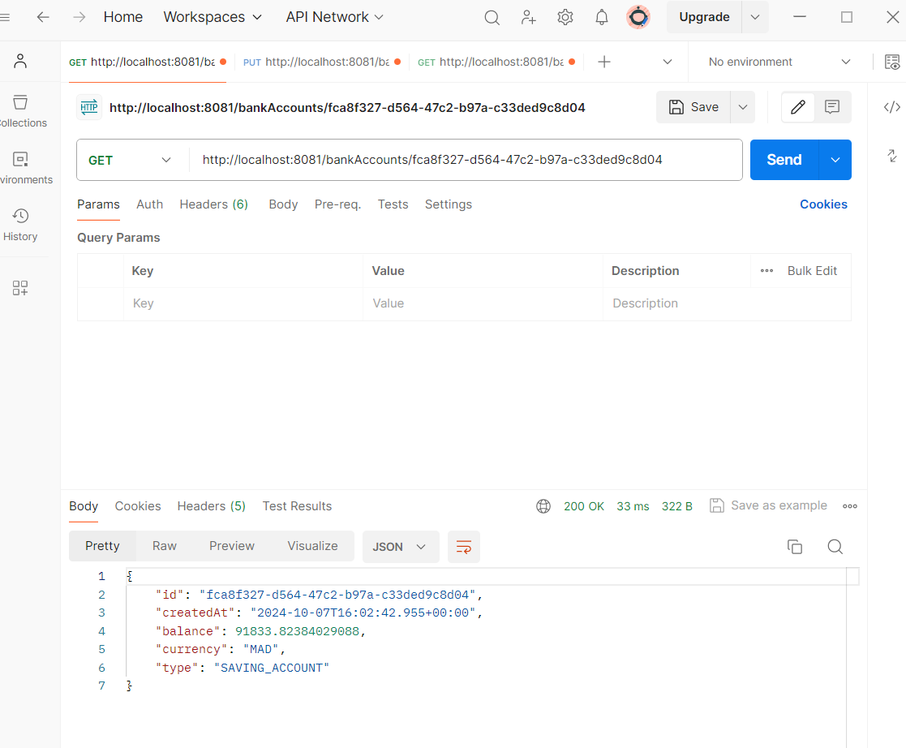

#### SWAGGER
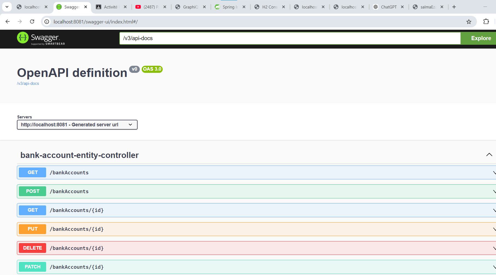
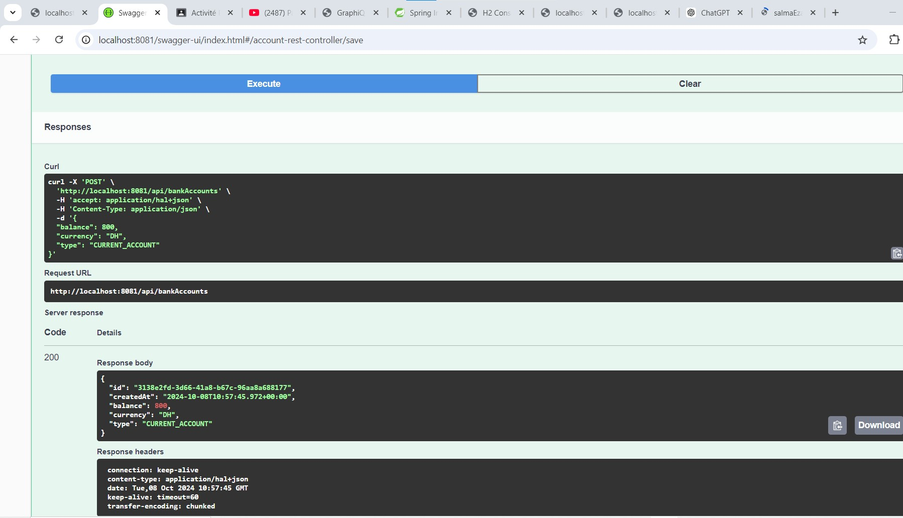

#### GRAPHQL
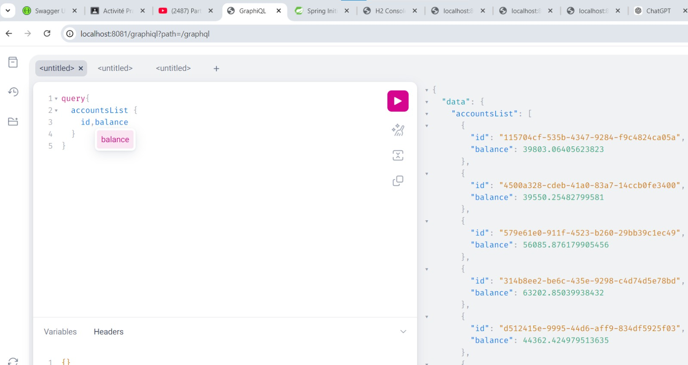
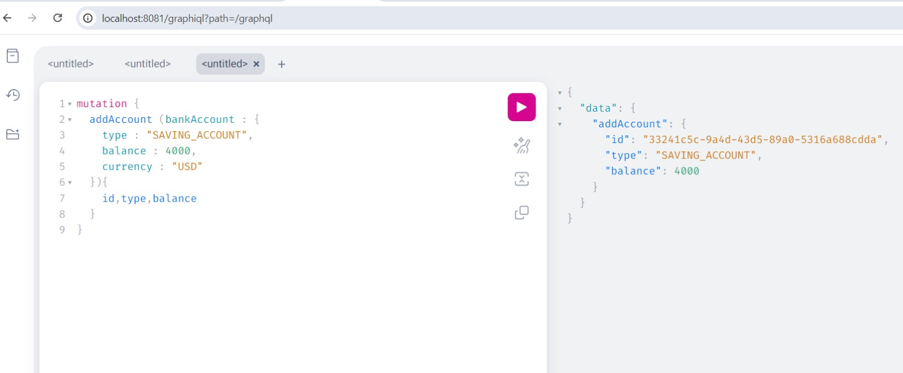
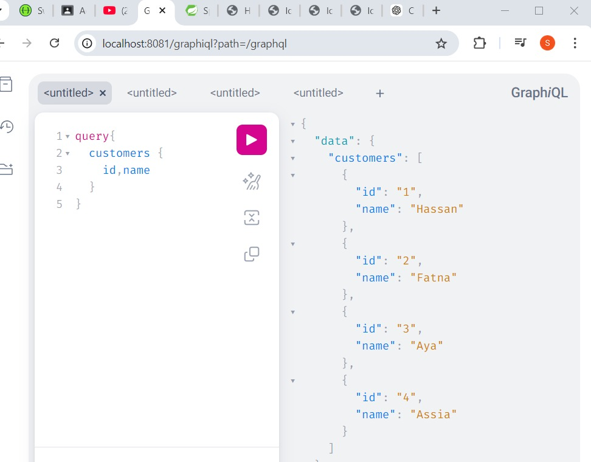
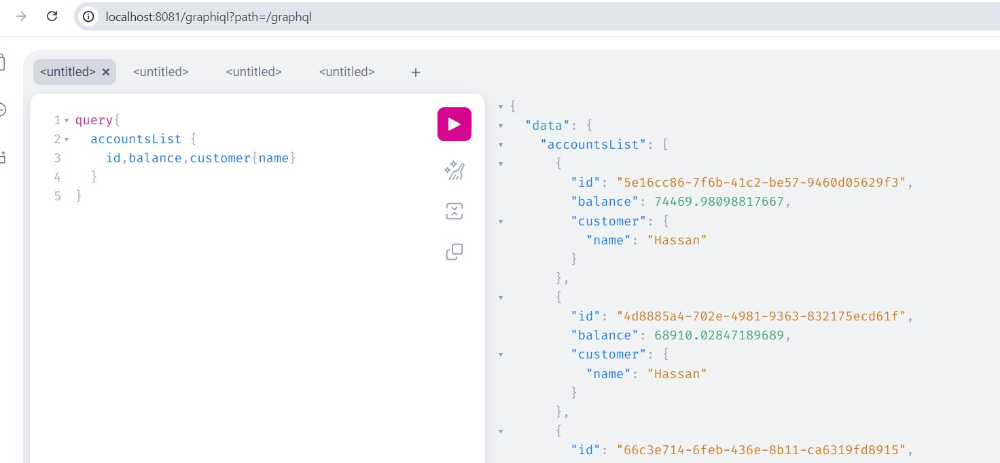
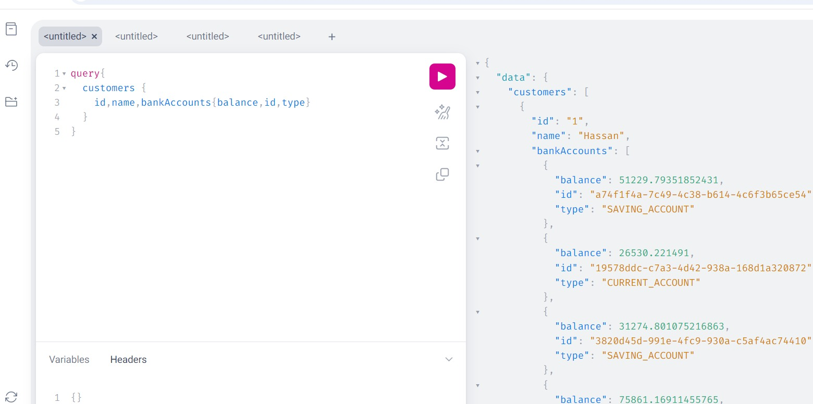